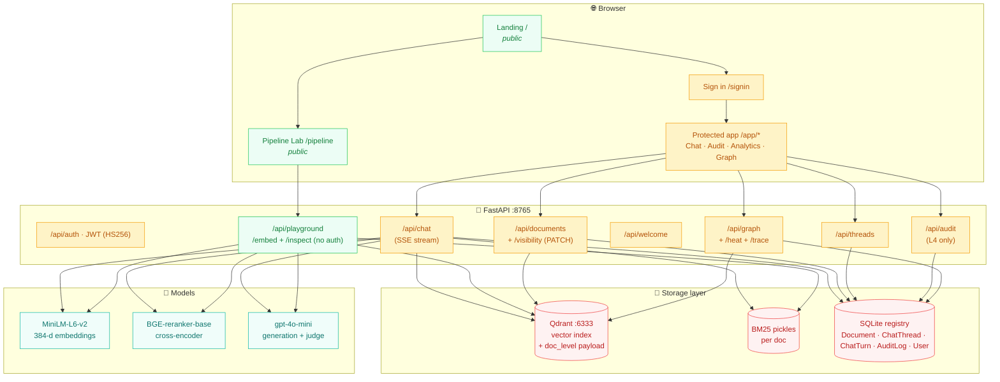
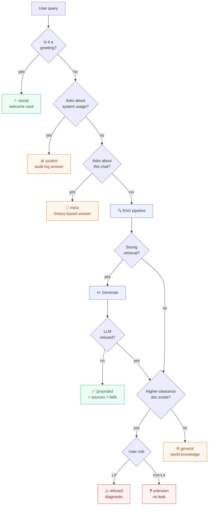
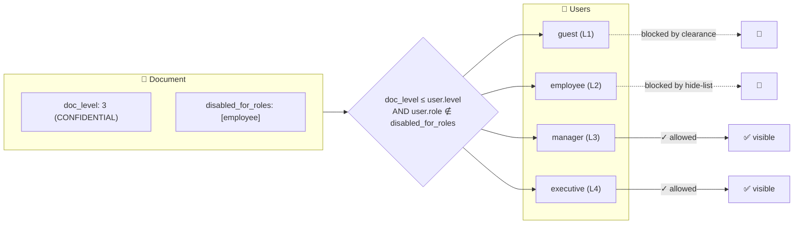
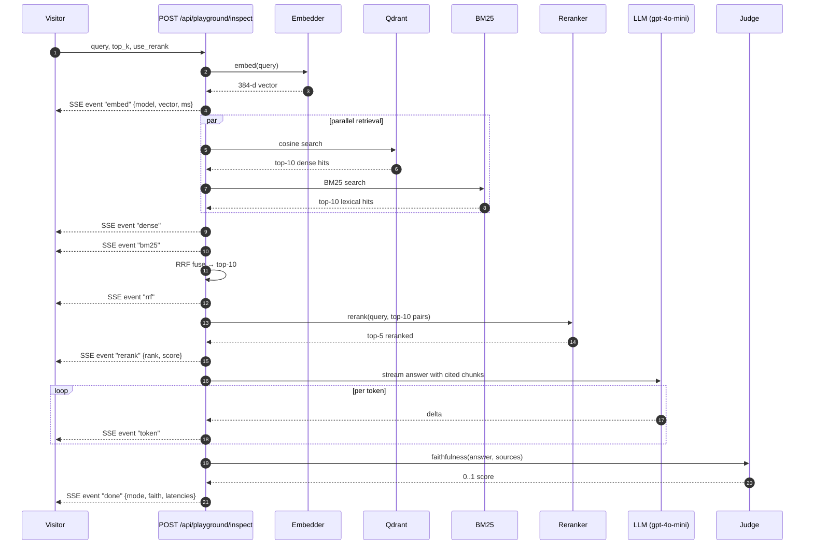

<div align="center">

# Prism RAG

**A retrieval-augmented chat platform with a six-mode answer engine, four-level RBAC enforced at the vector store, an interactive 3D knowledge graph, an executive ECharts analytics suite, and a public Pipeline Lab where anyone can watch the entire RAG system run live.**

[](#testing)
[](#tech-stack)
[](#license)

[**Try the Pipeline Lab live →**](https://github.com/sumith1309/Prism-RAG)

</div>

---

## Table of contents

1. [What is Prism RAG?](#what-is-prism-rag)
2. [System architecture](#system-architecture)
3. [The retrieval pipeline](#the-retrieval-pipeline)
4. [Six answer modes](#six-answer-modes)
5. [Role-based access control](#role-based-access-control)
6. [Public Pipeline Lab](#public-pipeline-lab)
7. [Knowledge Graph viewer](#knowledge-graph-viewer)
8. [Analytics + audit](#analytics--audit)
9. [Tech stack](#tech-stack)
10. [Quick start](#quick-start)
11. [API surface](#api-surface)
12. [Testing](#testing)
13. [Project layout](#project-layout)

---

## What is Prism RAG?

Prism RAG is a complete retrieval-augmented generation platform built around the principle that **what a user can read is enforced by their clearance, not by the model**. Access is gated at the vector-store filter — no prompt-injection can exfiltrate documents above the caller's level.

The platform ships:

- A **chat interface** that classifies every query into one of six answer modes (grounded / refused / general / unknown / social / meta / system) using a chain of intent detectors before retrieval ever runs.
- A **public Pipeline Lab** at `/pipeline` (no auth required) that streams the entire pipeline — embedding → dense + BM25 → RRF fusion → cross-encoder rerank → grounded generation → faithfulness judge — with a live BGE vector heatmap, a chunk rank-journey bump chart, hover-on-chunk popovers, and a side-by-side compare mode.
- A **3D Knowledge Graph** with an RBAC Lens (toggle through roles to watch nodes fade), live query trace overlay, and observability heat layer.
- An **ECharts analytics suite** for executives — donut, gauge, Sankey, heatmap, latency bars, top-cited chunks.
- A **per-role visibility kill-switch** so executives can hide any specific document from any subset of roles, atomically across the registry, vector index, and BM25 store.
- An **audit log** with sparkline KPI strip — every query writes one row with mode, latency, tokens, faithfulness, and the docs touched.

---

## System architecture



---

## The retrieval pipeline

A single user query travels through up to seven stages, each independently inspectable in the Pipeline Lab.

```mermaid
flowchart LR
  Q["User query<br/>+ chat history"] --> CTX{"Follow-up?"}
  CTX -- yes --> CtxRewrite["Contextualize<br/>(LLM rewrite)"]
  CTX -- no --> EM["Embed<br/>MiniLM-L6"]
  CtxRewrite --> EM
  EM --> RBAC["RBAC filter<br/>doc_level ≤ user.level<br/>AND role ∉ disabled_for_roles"]
  RBAC --> DENSE["Dense<br/>Qdrant cosine"]
  RBAC --> BM["BM25<br/>lexical"]
  DENSE --> RRF["RRF fusion<br/>score = Σ 1/(60+rank)"]
  BM --> RRF
  RRF --> RR["Cross-encoder rerank<br/>BGE-reranker-base"]
  RR --> Bar{"Passes<br/>relevance bar?"}
  Bar -- yes --> Gen["Grounded generation<br/>gpt-4o-mini · cited"]
  Bar -- no --> Probe["Bypass probe:<br/>does any HIGHER<br/>clearance match?"]
  Probe -- yes --> Ref["refused (L4)<br/>unknown (non-L4)"]
  Probe -- no --> GenK["general knowledge<br/>(any role)"]
  Gen --> Judge["Faithfulness judge<br/>LLM-scored 0..1"]
  Judge --> Demote{"Refused +<br/>low faith?"}
  Demote -- yes --> Probe
  Demote -- no --> Out["Final answer<br/>+ citations + score"]
  GenK --> Out
  Ref --> Out

  classDef stage fill:#eef2ff,stroke:#6366f1,color:#3730a3;
  classDef decision fill:#fff7ed,stroke:#f97316,color:#c2410c;
  classDef terminal fill:#ecfdf5,stroke:#22c55e,color:#15803d;
  class EM,CtxRewrite,DENSE,BM,RRF,RR,Gen,GenK,Judge stage;
  class CTX,Bar,Probe,Demote decision;
  class Out,Ref terminal;
```



**Each stage is configurable** via the in-app retrieval-settings drawer:
- Cross-encoder reranking (default ON)
- HyDE query rewriting (default OFF)
- Corrective RAG retry (default ON)
- Multi-query fan-out (default OFF — opt-in for higher recall, +5–8s latency)
- Faithfulness scoring (default ON)
- Top-K sources (default 5)

---

## Six answer modes

Every chat response is classified into exactly one mode, decided by a chain of intent detectors that run **before** retrieval.

| Mode | Triggered by | Behaviour | Latency |
|---|---|---|---|
| **social** | greetings, thanks, "what can you do?" | role-aware welcome card | ~1ms |
| **system** | "recent queries", "user activity", "audit data" | answers from audit log (RBAC-scoped per role) | ~1s |
| **meta** | "what was my first question?", "summarize our chat" | streams from thread history only | ~1s |
| **grounded** | substantive query that retrieved meaningful chunks | RAG with cited sources + faithfulness score | ~3–5s |
| **general** | retrieval finds nothing AND no higher-clearance match | LLM answers from world knowledge | ~2–3s |
| **refused** (L4) / **unknown** (non-L4) | retrieval finds nothing BUT bypass probe found higher-clearance match | exec sees a diagnostic; lower roles see "no confident answer" — never leaks | ~2s |

**Post-hoc demotion**: a refusal-phrase detector watches the LLM's grounded answer. If it reads like *"I could not find this in the provided documents"*, the system re-routes through the same bypass-probe matrix — so a chunk-retrieved-but-not-actually-useful response never misleads the user.



---

## Role-based access control

Four clearance levels mirror a four-tier corporate trust model. Every doc carries a `doc_level`; every user carries a `level`. The Qdrant `where` filter runs `doc_level <= user.level` on every retrieval — chunks above the caller's clearance are physically unreachable, not just hidden in the UI.

| Level | Label | Roles with access | Default content |
|---|---|---|---|
| 1 | PUBLIC | guest, employee, manager, executive | Training & compliance, public handbooks |
| 2 | INTERNAL | employee, manager, executive | Engineering runbooks, IT asset policy, platform architecture |
| 3 | CONFIDENTIAL | manager, executive | Q4 financials, product roadmap, vendor contracts |
| 4 | RESTRICTED | executive | Salary structure, board minutes, security incidents |

### Per-role visibility kill-switch

On top of the clearance gate, the **executive can hide any specific document from any subset of non-exec roles** independently. For example, exec can publish a CONFIDENTIAL doc visible to manager but hidden from employee, all without changing the doc's classification.



The executive controls this through the gear menu on each document card — a unified "Visible to" picker that derives both the classification (`doc_level`) and the hide-list (`disabled_for_roles`) atomically. When the level changes, the system rewrites the per-chunk Qdrant payload **and** the BM25 pickle metadata in one transaction so retrieval picks up the new clearance immediately, no re-ingest required.

---

## Public Pipeline Lab

The flagship public surface at `/pipeline`. No login required. Anyone can paste a question and watch the entire RAG system run live against the full corpus.



**Visualizations on the page:**

- **System Flow diagram** — SVG architectural map of the entire system, hover any node for an in-context explanation, watch the active stage pulse with its layer color as the SSE events arrive.
- **7-stage progress ribbon** — flowing particle animation along the edges between active stages.
- **Embedding fingerprint** — diverging-colour heatmap of the actual 384-dim vector (purple = positive, orange = negative).
- **Rank Journey bump chart** — every chunk's rank tracked across Dense → BM25 → RRF → Rerank, with distinct vivid colours for the surviving winners and faint dashed grey for false positives.
- **Per-stage cards** — actual hits with score bars, "what it does" + "why it matters" explanations, and a `?` icon that opens a theory deep-dive modal (algorithm explainer, formula, citations).
- **Compare mode** — toggle on, run any query, see results side-by-side with rerank ON vs OFF.
- **Hover-on-chunk popovers** — full chunk text with query terms highlighted in yellow.

---

## Knowledge Graph viewer

A 3D force-directed graph at `/app/graph` showing every document and chunk as nodes connected by containment edges, colour-coded by clearance level.

**Interactive layers:**

- **RBAC Lens** — exec toggles between guest / employee / manager / executive views; nodes above that role's clearance fade to ghost in real time. Visual proof of the security model working.
- **Live Query Trace** — type a query and the retrieval pipeline lights up across the corpus: dense hits glow blue, BM25 hits glow orange, RRF winners purple, cross-encoder rerank top-K bright yellow.
- **Observability Heat** — node size scales with how often each chunk has been retrieved; colour intensity scales with citation count from the audit log. Dead-weight chunks visibly dim.
- **Inspector pane** — click any node to see filename, classification, uploader identity, full chunk text, and current trace stage.

---

## Analytics + audit

The executive dashboard at `/app/analytics` is built entirely from the audit log using ECharts:

- **Donut** — answer-mode distribution with center-label total
- **Gauge** — average grounded-answer faithfulness (three-band colour: red < 0.5, amber 0.5–0.8, green ≥ 0.8)
- **Stacked area** — last 48h activity by mode
- **Sankey** — `Username → Answer mode` flow
- **Heatmap** — day-of-week × hour-of-day query density
- **Stacked horizontal bar** — average latency breakdown (retrieve / rerank / generate)
- **Horizontal bar** — top users by query count

The **audit page** at `/app/audit` adds a sparkline KPI strip on top of the queryable table: queries today, refused %, average latency, average faithfulness — each with a 24h trend line.

---

## Tech stack

| Layer | Choice | Notes |
|---|---|---|
| Frontend framework | **React 18 + TypeScript + Vite** | dev server :5173 |
| UI library | Tailwind CSS + framer-motion + lucide-react | light premium SaaS theme |
| Charts | **ECharts 6** (`echarts-for-react`) | analytics + KPI strips + pipeline lab |
| 3D graph | `react-force-graph-3d` + Three.js | knowledge graph viewer |
| Backend | **FastAPI** + uvicorn + SQLModel + sse-starlette | async SSE streaming for chat + pipeline |
| Vector DB | **Qdrant** | dense index, RBAC payload filter |
| Lexical search | `rank_bm25` (in-process, pickled per doc) | combined with dense via RRF |
| Embeddings | `sentence-transformers/all-MiniLM-L6-v2` | 384 dims, CPU-fast |
| Reranker | `BAAI/bge-reranker-base` | cross-encoder, 278M params |
| Generation LLM | OpenAI `gpt-4o-mini` | OpenAI-compatible endpoint |
| Auth | JWT (HS256) + bcrypt | 4-role token claims |
| Persistence | SQLite (single-file) | Document, User, ChatThread, ChatTurn, AuditLog |

---

## Quick start

### Prerequisites

- Docker (for Qdrant)
- Python 3.12+
- Node.js 18+
- An OpenAI API key (for generation)

### 1. Start Qdrant

The repo ships a `docker-compose.yml` that defines the Qdrant service:

```bash
docker compose -f homework-basic/docker-compose.yml up -d qdrant
```

### 2. Backend

```bash
cd backend
python -m venv .venv && source .venv/bin/activate
pip install -r requirements.txt

# Copy + configure secrets
cp .env.example .env
# Add your OPENAI_API_KEY

# Seed the corpus + 4 users
python -m entrypoint.seed --wipe

# Run the server
python -m entrypoint.serve
# → listens on http://127.0.0.1:8765
```

### 3. Frontend

```bash
cd frontend
npm install
npm run dev
# → http://localhost:5173
```

### 4. Try it

- Visit `http://localhost:5173` for the landing page.
- Click **Try the Pipeline Lab** to use the public showcase (no login).
- Click **Sign in** and use one of the seeded accounts:

| Username | Password | Role | Clearance |
|---|---|---|---|
| `guest` | `guest_pass` | Guest | L1 PUBLIC |
| `employee` | `employee_pass` | Employee | L2 INTERNAL |
| `manager` | `manager_pass` | Manager | L3 CONFIDENTIAL |
| `exec` | `exec_pass` | Executive | L4 RESTRICTED |

---

## API surface

All routes live under `/api/`. Authenticated routes require a `Authorization: Bearer <jwt>` header.

### Public

| Method | Path | Purpose |
|---|---|---|
| GET | `/health` | Qdrant connectivity, model info, LLM-configured flag |
| POST | `/auth/login` | Issues JWT (HS256) on bcrypt password match |
| POST | `/playground/retrieve` | PUBLIC-only retrieval breakdown for landing demo |
| POST | `/playground/embed` | Returns the live BGE/MiniLM vector for any query |
| POST | `/playground/inspect` | SSE stream — full pipeline (embed → dense → bm25 → rrf → rerank → token → done) at exec-level visibility |

### Authenticated (any signed-in user)

| Method | Path | Purpose |
|---|---|---|
| GET | `/auth/me` | Current user identity + clearance |
| GET | `/welcome` | Role-aware greeting payload (used by social-mode chat) |
| GET | `/documents` | Docs filtered by clearance + per-role hide-list |
| POST | `/documents` | Upload (clearance-capped, accepts `disabled_for_roles` from exec) |
| GET | `/threads` | Caller's chat threads |
| GET | `/threads/{id}` | Thread detail with full turn history + faithfulness scores |
| POST | `/chat` | SSE chat — emits thread, sources, token, refused, general_mode, unknown, cached, corrective, contextualized, welcome, done events |
| GET | `/graph` | Doc + chunk nodes + containment edges (RBAC-filtered) |
| GET | `/graph/heat` | Audit-aggregated retrieval + citation counts per node |
| POST | `/graph/trace` | Run all retrieval stages on a query for the live overlay |

### Executive only (L4)

| Method | Path | Purpose |
|---|---|---|
| PATCH | `/documents/{id}/visibility` | Update `doc_level` and/or `disabled_for_roles` atomically (rewrites Qdrant payload + BM25 metadata) |
| DELETE | `/documents/{id}` | Remove a document (also requires manager+ for delete; visibility toggles are L4-only) |
| GET | `/audit` | Full audit log (every query writes one row) |

---

## Testing

Integration tests cover RBAC, smart-mode routing, social/meta/system short-circuits, and clearance-capped uploads.

```bash
cd backend
.venv/bin/python -m pytest tests/integration/ -v
# 38 passed, 1 skipped
```

| Suite | Tests | Covers |
|---|---|---|
| `test_rbac.py` | 25 | Per-role access; no chunk above clearance ever leaves Qdrant |
| `test_smart_rag.py` | 10 | All 6 answer modes; metadata-leak protection by role |
| `test_uploads.py` | 3 | Clearance-capped uploads and the upload-above-own-level rejection |

---

## Project layout

```
prism-rag/
├── backend/                       # FastAPI + retrieval pipeline
│   ├── src/
│   │   ├── api/routers/           # auth, chat, documents, threads, audit, graph,
│   │   │                          # playground, welcome
│   │   ├── auth/                  # JWT + dependency injection helpers
│   │   ├── core/                  # SQLModel schemas, prompts, store, models
│   │   └── pipelines/             # embedding, retrieval, generation, loaders
│   ├── tests/integration/         # 38 tests, all green
│   └── entrypoint/                # serve / seed / ingest / query CLI
├── frontend/                      # React + Vite + Tailwind
│   └── src/
│       ├── pages/                 # Landing, SignIn, Chat, Audit, Analytics,
│       │                          # Graph, Pipeline (public)
│       ├── components/            # MessageBubble, DocumentCard,
│       │                          # VisibleToSelector, WelcomeCard, …
│       └── hooks/                 # useChatStream, useDocuments, useThreads
├── homework-basic/                # Standalone Python CLI exploration tool
│   ├── rag_cli.py                 # ~320-line single-file CLI for any PDF
│   └── docker-compose.yml         # Qdrant service definition
└── sir_documents/                 # Seed corpus (10 classified PDFs)
```

---

## Design principles

1. **RBAC at the filter, not the prompt.** The model physically cannot see what the user can't — no prompt-injection can exfiltrate it.
2. **Visible proof over claims.** Every feature ships with an artifact you can click — a trace panel, a heatmap, a sparkline, a 3D graph node — not just a promise in the docs.
3. **Six modes, one decision tree.** Intent classification happens before retrieval, so off-topic and meta questions never collapse into "no confident answer".
4. **Faithfulness as a safety net.** Every grounded answer is judged 0–1; low scores trigger automatic demotion so the user never sees a misleading citation.
5. **Public showcase, private app.** The flagship demo runs without auth so anyone can experience the system; sensitive features (audit, analytics, per-role visibility) stay behind login.

---

## License

MIT — see [LICENSE](./LICENSE).

---

<div align="center">

Built with FastAPI · React · Qdrant · OpenAI · ECharts · Three.js
<br/>
Source: [github.com/sumith1309/Prism-RAG](https://github.com/sumith1309/Prism-RAG)

</div>
