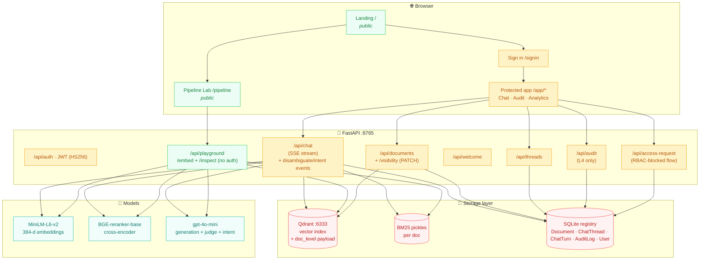
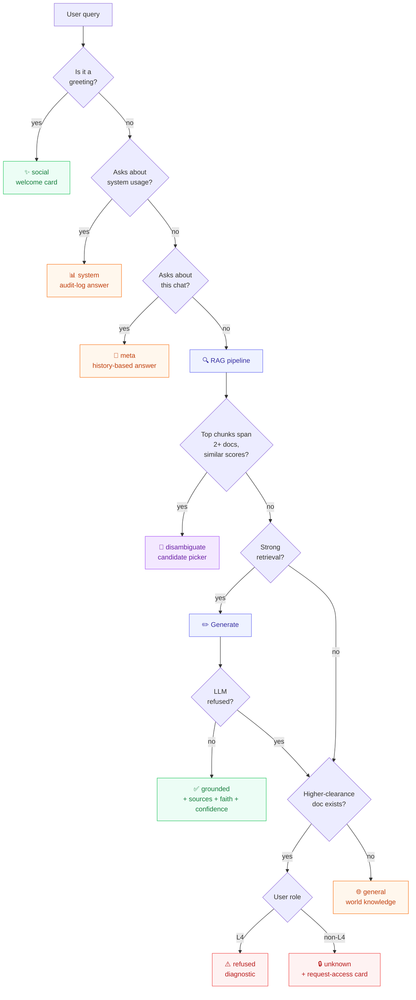
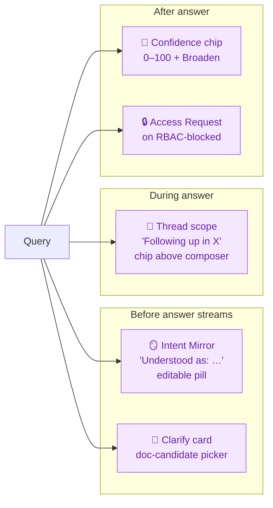
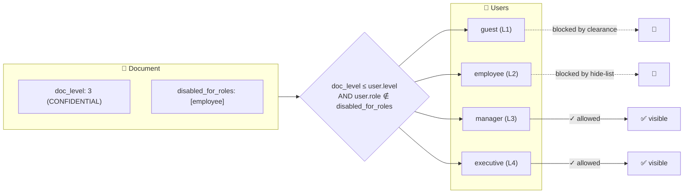
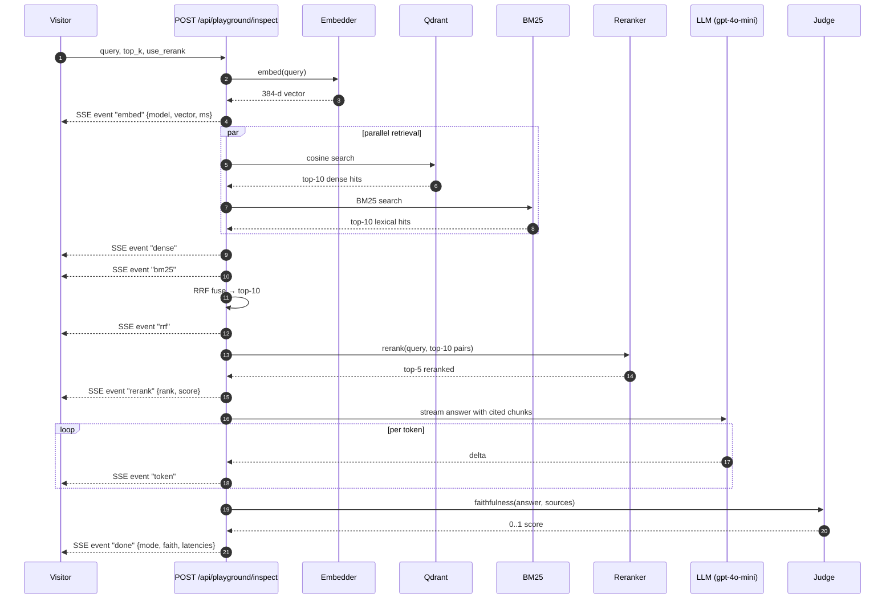

<div align="center">

# Prism RAG

**A retrieval-augmented chat platform with a seven-mode answer engine, five hyper-personalized agent layers, four-level RBAC enforced at the vector store, an executive ECharts analytics suite, and a public Pipeline Lab where anyone can watch the entire RAG system run live.**

[](#testing)
[](#tech-stack)
[](#license)

[**Try the Pipeline Lab live →**](https://github.com/sumith1309/Prism-RAG)

</div>

---

## Table of contents

1. [What is Prism RAG?](#what-is-prism-rag)
2. [System architecture](#system-architecture)
3. [The retrieval pipeline](#the-retrieval-pipeline)
4. [Seven answer modes](#seven-answer-modes)
5. [Agent layers — hyper-personalized UX](#agent-layers--hyper-personalized-ux)
6. [Role-based access control](#role-based-access-control)
7. [Public Pipeline Lab](#public-pipeline-lab)
8. [Analytics + audit](#analytics--audit)
9. [Tech stack](#tech-stack)
10. [Quick start](#quick-start)
11. [API surface](#api-surface)
12. [Testing](#testing)
13. [Project layout](#project-layout)

---

## What is Prism RAG?

Prism RAG is a complete retrieval-augmented generation platform built around two principles: **what a user can read is enforced by their clearance, not by the model**, and **the agent never silently guesses at ambiguous questions**. Access is gated at the vector-store filter — no prompt-injection can exfiltrate documents above the caller's level — and five agent-style UX layers on top of the retrieval pipeline make the system feel hyper-personalized.

The platform ships:

- A **chat interface** that classifies every query into one of seven answer modes (grounded / disambiguate / refused / general / unknown / social / meta / system) using a chain of intent detectors before retrieval ever runs.
- **Five agent layers** on top of the base RAG: **clarify-before-answer** (disambiguation picker), **intent mirror** (editable "understood as" pill), **confidence chip** (0–100 composite score), **thread-scoped memory** (auto-follow-up in the same doc), **RBAC-transparent refusal** (access-request flow).
- A **public Pipeline Lab** at `/pipeline` (no auth required) that streams the entire pipeline — embedding → dense + BM25 → RRF fusion → cross-encoder rerank → grounded generation → faithfulness judge — with a live BGE vector heatmap, a chunk rank-journey bump chart, hover-on-chunk popovers, and a side-by-side compare mode.
- An **ECharts analytics suite** for executives — donut, gauge, Sankey, heatmap, latency bars, top-cited chunks.
- A **per-role visibility kill-switch** so executives can hide any specific document from any subset of roles, atomically across the registry, vector index, and BM25 store.
- An **audit log** with sparkline KPI strip — every query writes one row with mode, latency, tokens, faithfulness, and the docs touched.

---

## System architecture



---

## The retrieval pipeline

A single user query travels through up to eight stages, each independently inspectable in the Pipeline Lab.

```mermaid
flowchart LR
  Q["User query<br/>+ chat history"] --> CTX{"Follow-up?"}
  CTX -- yes --> CtxRewrite["Contextualize<br/>(LLM rewrite)"]
  CTX -- no --> EM["Embed<br/>MiniLM-L6"]
  CtxRewrite --> EM
  EM --> RBAC["RBAC filter<br/>doc_level ≤ user.level<br/>AND role ∉ disabled_for_roles"]
  RBAC --> DENSE["Dense<br/>Qdrant cosine"]
  RBAC --> BM["BM25<br/>lexical"]
  DENSE --> RRF["RRF fusion<br/>score = Σ 1/(60+rank)"]
  BM --> RRF
  RRF --> RR["Cross-encoder rerank<br/>BGE-reranker-base"]
  RR --> Amb{"Multi-doc<br/>ambiguity?"}
  Amb -- yes --> Disamb["🤔 disambiguate<br/>candidate picker"]
  Amb -- no --> Bar{"Passes<br/>relevance bar?"}
  Bar -- yes --> Gen["Grounded generation<br/>gpt-4o-mini · cited"]
  Bar -- no --> Probe["Bypass probe:<br/>does any HIGHER<br/>clearance match?"]
  Probe -- yes --> Ref["refused (L4)<br/>unknown (non-L4)<br/>+ rbac_blocked flag"]
  Probe -- no --> GenK["general knowledge<br/>(any role)"]
  Gen --> Judge["Faithfulness judge<br/>LLM-scored 0..1"]
  Judge --> Conf["Confidence chip<br/>0..100 composite"]
  Judge --> Demote{"Refused +<br/>low faith?"}
  Demote -- yes --> Probe
  Demote -- no --> Out["Final answer<br/>+ citations + score"]
  GenK --> Out
  Ref --> Out
  Conf --> Out
  Disamb --> Out

  classDef stage fill:#eef2ff,stroke:#6366f1,color:#3730a3;
  classDef decision fill:#fff7ed,stroke:#f97316,color:#c2410c;
  classDef terminal fill:#ecfdf5,stroke:#22c55e,color:#15803d;
  classDef agent fill:#f3e8ff,stroke:#a855f7,color:#6b21a8;
  class EM,CtxRewrite,DENSE,BM,RRF,RR,Gen,GenK,Judge stage;
  class CTX,Bar,Probe,Demote,Amb decision;
  class Out,Ref terminal;
  class Disamb,Conf agent;
```



**Each stage is configurable** via the in-app retrieval-settings drawer:
- Cross-encoder reranking (default ON)
- HyDE query rewriting (default OFF)
- Corrective RAG retry (default ON)
- Multi-query fan-out (default OFF — opt-in for higher recall, +5–8s latency; can be triggered for one call via the Confidence Chip's **Broaden** button)
- Faithfulness scoring (default ON)
- Top-K sources (default 5)

---

## Seven answer modes

Every chat response is classified into exactly one mode, decided by a chain of intent detectors that run **before** retrieval. Each mode has its own visible UI treatment so the user always knows what kind of answer they're looking at.

| Mode | Triggered by | Behaviour | Latency |
|---|---|---|---|
| **social** | greetings, thanks, "what can you do?" | role-aware welcome card | ~1ms |
| **system** | "recent queries", "user activity", "audit data" | answers from audit log (RBAC-scoped per role) | ~1s |
| **meta** | "what was my first question?", "summarize our chat" | streams from thread history only | ~1s |
| **grounded** | substantive query that retrieved meaningful chunks | RAG with cited sources + faithfulness score + confidence chip | ~3–5s |
| **disambiguate** | top chunks span 2+ docs with comparable scores | shows a picker card with candidate docs instead of guessing | ~2s |
| **general** | retrieval finds nothing AND no higher-clearance match | LLM answers from world knowledge | ~2–3s |
| **refused** (L4) / **unknown** (non-L4) | retrieval finds nothing BUT bypass probe found higher-clearance match | exec sees a diagnostic; lower roles see an **access-request card** if RBAC-blocked, else "no confident answer" | ~2s |

**Post-hoc demotion**: a refusal-phrase detector watches the LLM's grounded answer. If it reads like *"I could not find this in the provided documents"*, the system re-routes through the same bypass-probe matrix — so a chunk-retrieved-but-not-actually-useful response never misleads the user.



---

## Agent layers — hyper-personalized UX

Five independently shipped agent behaviours sit on top of the base RAG. Each is a **visible clickable artifact** in the chat — not a silent internal heuristic — so the user can always see what the agent is doing and redirect it.



### 1. Clarify-before-answer (the `disambiguate` mode)

When top-K reranked chunks span **2+ distinct documents with scores within 20%** (absolute rerank), the system refuses to guess. Instead of blending snippets from different docs into one potentially-wrong answer, it emits a **disambiguate** event with the candidate documents, each accompanied by a one-line hint extracted from its top chunk plus a prettified label (e.g. `HRMS-HRMS-Portal-Report.docx` → **HRMS Portal Report**). The user clicks a candidate; the query re-runs scoped to that single doc via `preferred_doc_id`. The choice is persisted on the thread so reloading shows the picker frozen with the user's chosen doc checkmarked.

### 2. Intent Mirror (`intent` event + editable pill)

Before streaming, a fast LLM call produces a one-sentence restatement of the user's query — "You're asking…". Runs as `asyncio.create_task` in parallel with retrieval so the extra latency is absorbed by the existing retrieve step (4s timeout, 2s await-timeout). The restatement renders as a compact pill above the answer. The user can click the pencil, edit the interpretation inline, and submit — the edited text is sent back as a new user turn so retrieval gets a second shot at the real intent.

### 3. Confidence Chip (0–100 composite)

Every grounded answer gets a composite score blending **top rerank score × 0.5 + faithfulness × 0.5** (falls back to retrieval-only when faithfulness is unscored), clamped to `[5, 100]`. Rendered as a small inline chip with four color bands:

| Score | Band | Colour | Action |
|---|---|---|---|
| ≥ 80 | High confidence | green | — |
| 60–79 | Confident | blue | — |
| 40–59 | Limited | amber | shows **Broaden** button |
| < 40 | Low | red | shows **Broaden** button (stronger prompt) |

Clicking **Broaden** re-runs the last query with `use_multi_query: true` for that call only — ignores and doesn't mutate the user's global settings.

### 4. Thread-scoped memory (implicit follow-up)

Frontend-only pattern. Scans the last 3 grounded assistant turns; if ≥ 2 of them cite the **same doc** as their top source, the system quietly scopes new queries to that doc. The chip `Following up in <Prettified Doc> · N recent answers [×]` renders above the chat composer. Subsequent queries send `doc_ids: [scopeDocId]` automatically. Explicit document-filter selections from the sidebar always win over thread scope, and the user can dismiss the scope with the × button (tracked per-docId so dismissing one scope doesn't block a future different-doc scope).

### 5. RBAC-transparent refusal (access-request flow)

When `unknown` or `refused` was triggered by RBAC (a higher-clearance doc matched but was hidden from the caller), the backend sets an `rbac_blocked: true` flag. Instead of showing the bland *"no confident answer"* card, the frontend renders the **Access Request Banner** — a card with a lock icon and a "Request access" button. Clicking it opens an inline reason textarea; submitting POSTs to `/api/access-request`, which writes a new `access_request` row to the audit log that executives can review. The banner flips to a success state inline so the user never leaves the chat.

### Tuning constants (worth knowing)

| Constant | Value | Where | Effect |
|---|---:|---|---|
| `_DISAMBIG_SCORE_GAP` | 0.20 | chat.py | How close top-2 doc scores must be to trigger disambiguation |
| `_DISAMBIG_MIN_TOP_SCORE` | 0.25 | chat.py | Below this rerank score, don't disambiguate (weak retrieval, fall through to general/unknown) |
| Intent task timeout | 4.0s | chat.py | Max time for the intent LLM call |
| Intent emission timeout | 2.0s | chat.py | Max time to await the intent result before streaming |
| Confidence bands | 40/60/80 | ConfidenceChip.tsx | Colour thresholds |
| `SCOPE_LOOKBACK` | 3 | ChatInterface.tsx | Recent grounded turns inspected for thread-scope detection |
| `SCOPE_MIN_HITS` | 2 | ChatInterface.tsx | Same doc must appear in this many turns to trigger scope |

---

## Role-based access control

Four clearance levels mirror a four-tier corporate trust model. Every doc carries a `doc_level`; every user carries a `level`. The Qdrant `where` filter runs `doc_level <= user.level` on every retrieval — chunks above the caller's clearance are physically unreachable, not just hidden in the UI.

| Level | Label | Roles with access | Default content |
|---|---|---|---|
| 1 | PUBLIC | guest, employee, manager, executive | Training & compliance, public handbooks |
| 2 | INTERNAL | employee, manager, executive | Engineering runbooks, IT asset policy, platform architecture |
| 3 | CONFIDENTIAL | manager, executive | Q4 financials, product roadmap, vendor contracts |
| 4 | RESTRICTED | executive | Salary structure, board minutes, security incidents |

### Per-role visibility kill-switch

On top of the clearance gate, the **executive can hide any specific document from any subset of non-exec roles** independently. For example, exec can publish a CONFIDENTIAL doc visible to manager but hidden from employee, all without changing the doc's classification.



The executive controls this through the gear menu on each document card — a unified "Visible to" picker that derives both the classification (`doc_level`) and the hide-list (`disabled_for_roles`) atomically. When the level changes, the system rewrites the per-chunk Qdrant payload **and** the BM25 pickle metadata in one transaction so retrieval picks up the new clearance immediately, no re-ingest required.

---

## Public Pipeline Lab

The flagship public surface at `/pipeline`. No login required. Anyone can paste a question and watch the entire RAG system run live against the full corpus.



**Visualizations on the page:**

- **System Flow diagram** — SVG architectural map of the entire system, hover any node for an in-context explanation, watch the active stage pulse with its layer color as the SSE events arrive.
- **7-stage progress ribbon** — flowing particle animation along the edges between active stages.
- **Embedding fingerprint** — diverging-colour heatmap of the actual 384-dim vector (purple = positive, orange = negative).
- **Rank Journey bump chart** — every chunk's rank tracked across Dense → BM25 → RRF → Rerank, with distinct vivid colours for the surviving winners and faint dashed grey for false positives.
- **Per-stage cards** — actual hits with score bars, "what it does" + "why it matters" explanations, and a `?` icon that opens a theory deep-dive modal (algorithm explainer, formula, citations).
- **Compare mode** — toggle on, run any query, see results side-by-side with rerank ON vs OFF.
- **Hover-on-chunk popovers** — full chunk text with query terms highlighted in yellow.

---

## Analytics + audit

The executive dashboard at `/app/analytics` is built entirely from the audit log using ECharts:

- **Donut** — answer-mode distribution with center-label total (includes the new `disambiguate` mode)
- **Gauge** — average grounded-answer faithfulness (three-band colour: red < 0.5, amber 0.5–0.8, green ≥ 0.8)
- **Stacked area** — last 48h activity by mode
- **Sankey** — `Username → Answer mode` flow
- **Heatmap** — day-of-week × hour-of-day query density
- **Stacked horizontal bar** — average latency breakdown (retrieve / rerank / generate)
- **Horizontal bar** — top users by query count

The **audit page** at `/app/audit` adds a sparkline KPI strip on top of the queryable table: queries today, refused %, average latency, average faithfulness — each with a 24h trend line. Access requests from RBAC-blocked unknown turns are stored with `answer_mode = "access_request"` and show up in the same table so executives can review them in context.

---

## Tech stack

| Layer | Choice | Notes |
|---|---|---|
| Frontend framework | **React 18 + TypeScript + Vite** | dev server :5173 |
| UI library | Tailwind CSS + framer-motion + lucide-react | light premium SaaS theme |
| Charts | **ECharts 6** (`echarts-for-react`) | analytics + KPI strips + pipeline lab |
| Backend | **FastAPI** + uvicorn + SQLModel + sse-starlette | async SSE streaming for chat + pipeline |
| Vector DB | **Qdrant** | dense index, RBAC payload filter |
| Lexical search | `rank_bm25` (in-process, pickled per doc) | combined with dense via RRF |
| Embeddings | `sentence-transformers/all-MiniLM-L6-v2` | 384 dims, CPU-fast |
| Reranker | `BAAI/bge-reranker-base` | cross-encoder, 278M params |
| Generation LLM | OpenAI `gpt-4o-mini` | also powers intent-mirror restatement + faithfulness judge |
| Auth | JWT (HS256) + bcrypt | 4-role token claims |
| Persistence | SQLite (single-file) | Document, User, ChatThread, ChatTurn, AuditLog |

---

## Quick start

### Prerequisites

- Docker (for Qdrant)
- Python 3.12+
- Node.js 18+
- An OpenAI API key (for generation)

### 1. Start Qdrant

The repo ships a `docker-compose.yml` that defines the Qdrant service:

```bash
docker compose -f homework-basic/docker-compose.yml up -d qdrant
```

### 2. Backend

```bash
cd backend
python -m venv .venv && source .venv/bin/activate
pip install -r requirements.txt

# Copy + configure secrets
cp .env.example .env
# Add your OPENAI_API_KEY

# Seed the corpus + 4 users
python -m entrypoint.seed --wipe

# Run the server
python -m entrypoint.serve
# → listens on http://127.0.0.1:8765
```

### 3. Frontend

```bash
cd frontend
npm install
npm run dev
# → http://localhost:5173
```

### 4. Try it

- Visit `http://localhost:5173` for the landing page.
- Click **Try the Pipeline Lab** to use the public showcase (no login).
- Click **Sign in** and use one of the seeded accounts:

| Username | Password | Role | Clearance |
|---|---|---|---|
| `guest` | `guest_pass` | Guest | L1 PUBLIC |
| `employee` | `employee_pass` | Employee | L2 INTERNAL |
| `manager` | `manager_pass` | Manager | L3 CONFIDENTIAL |
| `exec` | `exec_pass` | Executive | L4 RESTRICTED |

### 5. Demo the agent layers

1. Sign in as any role, upload two overlapping docs (e.g. HR Policy Handbook + HRMS Portal Report).
2. Ask **"HRMS flow"** → the **disambiguate card** fires with both docs as candidates.
3. Pick one; the answer streams scoped to that doc.
4. Watch the **Intent Mirror** pill appear above the streamed answer. Click the pencil, rephrase, re-run.
5. Note the **Confidence Chip** below the intent pill — try a vague query to see amber/red + **Broaden**.
6. Ask 2–3 more questions about the same doc — the **Following up in X** chip appears above the composer.
7. Sign in as `guest`, ask for something RESTRICTED → the **Access Request Banner** replaces the bland unknown card.

---

## API surface

All routes live under `/api/`. Authenticated routes require an `Authorization: Bearer <jwt>` header.

### Public

| Method | Path | Purpose |
|---|---|---|
| GET | `/health` | Qdrant connectivity, model info, LLM-configured flag |
| POST | `/auth/login` | Issues JWT (HS256) on bcrypt password match |
| POST | `/playground/retrieve` | PUBLIC-only retrieval breakdown for landing demo |
| POST | `/playground/embed` | Returns the live BGE/MiniLM vector for any query |
| POST | `/playground/inspect` | SSE stream — full pipeline (embed → dense → bm25 → rrf → rerank → token → done) at exec-level visibility |

### Authenticated (any signed-in user)

| Method | Path | Purpose |
|---|---|---|
| GET | `/auth/me` | Current user identity + clearance |
| GET | `/welcome` | Role-aware greeting payload (used by social-mode chat) |
| GET | `/documents` | Docs filtered by clearance + per-role hide-list |
| POST | `/documents` | Upload (clearance-capped, accepts `disabled_for_roles` from exec) |
| GET | `/threads` | Caller's chat threads |
| GET | `/threads/{id}` | Thread detail with full turn history + faithfulness scores + disambiguation state |
| POST | `/chat` | SSE chat — emits thread, sources, token, refused, general_mode, unknown, cached, corrective, contextualized, welcome, **disambiguate**, **intent**, done events (with `confidence` + `rbac_blocked` on done) |
| POST | `/access-request` | Logs an audit row when a user clicks "Request access" on an RBAC-blocked unknown |

### Executive only (L4)

| Method | Path | Purpose |
|---|---|---|
| PATCH | `/documents/{id}/visibility` | Update `doc_level` and/or `disabled_for_roles` atomically (rewrites Qdrant payload + BM25 metadata) |
| DELETE | `/documents/{id}` | Remove a document (also requires manager+ for delete; visibility toggles are L4-only) |
| GET | `/audit` | Full audit log (every query writes one row, including `access_request` rows from the new flow) |

### Chat request extensions (agent layer)

The `/chat` endpoint accepts three extra optional fields to power the agent layers:

| Field | Type | Effect |
|---|---|---|
| `preferred_doc_id` | `string?` | Hard-scope retrieval to a single doc. Set by the frontend when the user picks a candidate in the disambiguation card. Implicitly forces `skip_disambiguation: true`. |
| `override_intent` | `string?` | Use this string as the search query instead of `query`. Set by the frontend when the user edits the Intent Mirror pill. The original `query` still appears in the chat log; retrieval runs against the override. |
| `skip_disambiguation` | `bool` | Bypass the ambiguity detector on this call. Auto-set when `preferred_doc_id` is present. |

---

## Testing

Integration tests cover RBAC, smart-mode routing, social/meta/system short-circuits, and clearance-capped uploads.

```bash
cd backend
.venv/bin/python -m pytest tests/integration/ -v
# 38 passed, 1 skipped
```

| Suite | Tests | Covers |
|---|---|---|
| `test_rbac.py` | 25 | Per-role access; no chunk above clearance ever leaves Qdrant |
| `test_smart_rag.py` | 10 | All answer modes; metadata-leak protection by role |
| `test_uploads.py` | 3 | Clearance-capped uploads and the upload-above-own-level rejection |

---

## Project layout

```
prism-rag/
├── backend/                       # FastAPI + retrieval pipeline
│   ├── src/
│   │   ├── api/routers/           # auth, chat (+ agent layers),
│   │   │                          # documents, threads, audit,
│   │   │                          # playground, welcome
│   │   ├── auth/                  # JWT + dependency injection helpers
│   │   ├── core/                  # SQLModel schemas, prompts, store, models
│   │   └── pipelines/             # embedding, retrieval, generation, loaders
│   ├── tests/integration/         # 38 tests, all green
│   └── entrypoint/                # serve / seed / ingest / query CLI
├── frontend/                      # React + Vite + Tailwind
│   └── src/
│       ├── pages/                 # Landing, SignIn, Chat, Audit,
│       │                          # Analytics, Pipeline (public)
│       ├── components/            # MessageBubble, DocumentCard,
│       │                          # VisibleToSelector, WelcomeCard,
│       │                          # DisambiguationCard, IntentMirror,
│       │                          # ConfidenceChip, AccessRequestBanner
│       └── hooks/                 # useChatStream, useDocuments, useThreads
├── homework-basic/                # Standalone Python CLI exploration tool
│   ├── rag_cli.py                 # ~320-line single-file CLI for any PDF
│   └── docker-compose.yml         # Qdrant service definition
└── sir_documents/                 # Seed corpus (10 classified PDFs)
```

---

## Design principles

1. **RBAC at the filter, not the prompt.** The model physically cannot see what the user can't — no prompt-injection can exfiltrate it.
2. **Visible proof over claims.** Every feature ships with an artifact you can click — a trace panel, an intent pill, a disambiguation card, a confidence chip, a sparkline — not just a promise in the docs.
3. **The agent never silently guesses.** Ambiguous queries pause for confirmation; low-confidence answers self-label; RBAC-blocked content routes to an actionable access-request flow.
4. **Seven modes, one decision tree.** Intent classification happens before retrieval, so off-topic, meta, and multi-doc questions never collapse into "no confident answer".
5. **Faithfulness as a safety net.** Every grounded answer is judged 0–1 and also surfaced as a 0–100 confidence chip; low scores trigger automatic demotion or invite the user to broaden.
6. **Public showcase, private app.** The flagship demo runs without auth so anyone can experience the system; sensitive features (audit, analytics, per-role visibility, access requests) stay behind login.

---

## License

MIT — see [LICENSE](./LICENSE).

---

<div align="center">

Built with FastAPI · React · Qdrant · OpenAI · ECharts
<br/>
Source: [github.com/sumith1309/Prism-RAG](https://github.com/sumith1309/Prism-RAG)

</div>
